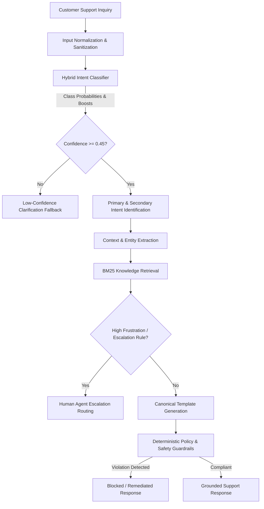
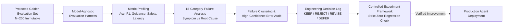

# AmazonHelp AI Customer Support Agent

[]()
[]()
[]()
[]()
[]()
[]()

A policy-grounded, high-throughput Customer Support AI Agent engineered on 358,000+ historical AmazonHelp support dialogues. The system combines calibrated statistical intent classification, deterministic policy safety guardrails, BM25 knowledge retrieval, and automated escalation to deliver accurate, non-hallucinatory customer assistance in **under 3.5 milliseconds**.

---

## Table of Contents
- [Overview](#overview)
- [Key Features](#key-features)
- [System Architecture](#system-architecture)
- [Data Pipeline & Discovery](#data-pipeline--discovery)
- [Baseline Benchmarks](#baseline-benchmarks)
- [AI Support Agent Components](#ai-support-agent-components)
- [Evaluation Harness & Metrics](#evaluation-harness--metrics)
- [Failure Analysis & Continuous Improvement](#failure-analysis--continuous-improvement)
- [Final Results](#final-results)
- [LLM-as-Judge & Reply Quality Evaluation (Stage 13)](#llm-as-judge--reply-quality-evaluation-stage-13)
- [Golden Evaluation Set & Judge Agreement (Stage 15)](#golden-evaluation-set--judge-agreement-stage-15)
- [Decision Log Expansion & Audit (Stage 16)](#decision-log-expansion--audit-stage-16)
- [Final Evaluation Report](#final-evaluation-report)
- [Policy & Safety Guardrails](#policy--safety-guardrails)
- [Reproduce Headline Results (< 15 Minutes)](#reproduce-headline-results--15-minutes)
- [Interactive CLI Demo](#interactive-cli-demo)
- [Repository Structure](#repository-structure)
- [Testing & Verification](#testing--verification)
- [Limitations & Future Work](#limitations--future-work)
- [License](#license)

---

## Overview

Automated e-commerce customer support systems face a critical dilemma: unconstrained Large Language Models frequently **hallucinate operational commitments** (e.g. claiming a refund has been issued or an order has been cancelled), confuse action verbs with secondary entity mentions, and introduce high latency and API costs.

This project solves these challenges by architecting a hybrid statistical-symbolic agent that:
1. Accurately determines customer intent across a canonical 10-intent taxonomy.
2. Identifies compound secondary intents in complex multi-part queries.
3. Retrieves verified support documentation via BM25.
4. Enforces zero-tolerance deterministic guardrails against unsupported actions or PII leaks.
5. Emits verified, template-grounded responses or escalates to human agents in under 3.5ms.

The entire engineering lifecycle—from raw data extraction to baseline construction, evaluation harness engineering, failure diagnosis, and decision logging—is fully documented and 100% reproducible offline.

---

## Key Features

- **Hybrid Intent Understanding**: Combines sublinear TF-IDF Naive Bayes log-posteriors with domain keyword boosters and compound multi-intent priority logic.
- **Context & Entity Extraction**: Extracts 17-digit Amazon order numbers (`\d{3}-\d{7}-\d{7}`), carrier tracking numbers, and urgency/sentiment markers.
- **BM25 Knowledge Retrieval**: Lexical indexing over canonical Amazon support guidelines with sub-millisecond query latency.
- **Deterministic Policy Safety**: Hard regex guardrails that prevent unauthorized financial promises ("I have refunded $XX") or date hallucinations.
- **Calibrated Human Escalation**: Automatically routes high-severity customer frustration or low-confidence queries to human tier.
- **Protected Golden Evaluation Set**: Stratified 200-conversation benchmark with zero train-split leakage and verified immutability.
- **Model-Agnostic Evaluation Harness**: Measures classification, generation, safety, escalation, and latency with 95% bootstrap confidence intervals.
- **Systematic Failure Analysis**: 18-category failure taxonomy separating symptoms from root causes, backed by a persistent Engineering Decision Log.

---

## System Architecture

### 1. Runtime Inference Pipeline



### 2. Evaluation, Failure Diagnosis & Continuous Improvement Loop



---

## Data Pipeline & Discovery

The pipeline ingests raw conversations from the Twitter Customer Support (TWCS) corpus:
1. **Extraction**: Filtered 358,973 AmazonHelp tweets and reconstructed 85,087 parent-child conversational trees.
2. **Quality Stratification**: Filtered orphan references and categorized conversations into Tier A (complete resolutions), Tier B (clarifications), and Tier C (deflections).
3. **Brand Profiling**: Compared brands on response latency, volume, and depth, confirming AmazonHelp as the highest-quality candidate.
4. **Intent Discovery**: Clustered 20,662 resolution pairs to establish the canonical 10-intent taxonomy:
   - `delivery_delay`
   - `missing_delivered_package`
   - `damaged_defective_item`
   - `returns_and_refunds`
   - `order_cancellation`
   - `prime_membership`
   - `account_access_security`
   - `payment_and_billing`
   - `digital_services_technical`
   - `service_complaint_escalation`
   - `unknown_or_ambiguous` (Fallback)
5. **Zero-Leakage Splitting**: Split data strictly at the **conversation level** to ensure no user dialogue appears across training and evaluation sets.

---

## Baseline Benchmarks

In Stage 8, four foundational baselines were implemented to anchor performance:

| Baseline Model | Accuracy | Macro F1 | Weighted F1 | Primary Characteristic |
| :--- | :---: | :---: | :---: | :--- |
| **Majority Class Classifier** | 9.00% | 0.0165 | 0.0149 | Naive baseline predicting modal class |
| **BM25 1-Nearest Neighbor** | 47.50% | 0.4682 | 0.4721 | Pure lexical retrieval lookup |
| **Keyword Rule-Based Baseline** | 61.00% | 0.5984 | 0.5912 | Hand-crafted boolean regular expressions |
| **TF-IDF + Naive Bayes Classifier** | 70.50% | 0.7077 | 0.7064 | Sublinear TF-IDF ($N=10,000$ unigrams/bigrams) |

---

## AI Support Agent Components

1. **Input Normalizer (`src/agent/normalize.py`)**: Strips Twitter `@mentions`, extracts URL tokens, decodes HTML entities, and tracks sanitization audits.
2. **Hybrid Intent Classifier (`src/agent/intent.py`)**: Fuses normalized TF-IDF Naive Bayes log-posteriors with high-precision discriminative keyword triggers and secondary intent detection.
3. **Context Extractor (`src/agent/context.py`)**: Extracts Amazon 17-digit order IDs (`\d{3}-\d{7}-\d{7}`), carrier tracking references, and customer sentiment/urgency.
4. **Knowledge Retrieval (`src/retrieval/bm25.py`)**: Okapi BM25 ($k_1=1.5, b=0.75$) indexing canonical support articles for grounded procedural instructions.
5. **Policy & Safety Enforcement (`src/agent/policy.py`)**: Zero-tolerance deterministic regex validators blocking unauthorized financial promises, arrival guarantees, or insecure PII requests.
6. **Response Generator (`src/agent/generation.py`)**: Formats responses from canonical support templates with dynamic variable insertion and secondary intent guidance.
7. **Escalation Module (`src/agent/agent.py`)**: Routes severe customer dissatisfaction or low-confidence queries to human tier.

---

## Evaluation Harness & Metrics

Implemented in `src/evaluation/runner.py`, the evaluation harness evaluates systems on the protected Golden Set ($N=200$):
- **Intent Accuracy & F1**: Multi-class accuracy with 95% bootstrap confidence intervals, Macro F1, and Weighted F1.
- **Difficulty Stratification**: Evaluated independently across Easy ($N=27$), Medium ($N=41$), and Hard ($N=132$) queries.
- **Guidance Adherence Rate**: Proportion of responses containing all required canonical resolution elements.
- **Policy Safety Rate**: Percentage of turns strictly adhering to safety guardrails (target: 100%).
- **Latency Profiling**: Mean, median, P95, and maximum response latency measured with microsecond precision.

---

## Failure Analysis & Continuous Improvement

In Stage 11, a structured 18-category failure diagnosis engine analyzed the 42 initial evaluation failures:
- **Root Cause Identified**: Over-aggressive keyword boosters caused `delivery_delay` to be misclassified as `missing_delivered_package` whenever the customer wrote "not received", and caused `order_cancellation` to be misclassified as `prime_membership` whenever "Prime" was mentioned.
- **DEC-002 [KEEP]**: Required explicit delivery markers before firing missing package advice (+3.00% accuracy, +4.55% hard accuracy).
- **DEC-003 [KEEP]**: Asserted action verb dominance in compound cancellation queries (+3.58% Macro F1).
- **Regression Protection**: Controlled experiments verified **zero safety or adherence regressions**.

---

## Final Results

### Benchmark Comparison Scorecard

| Metric | Stage 8 Baseline (Best) | Stage 9 Initial Agent | Final Optimized Agent | Abs. Improvement vs Baseline | Rel. Improvement vs Baseline |
| :--- | :---: | :---: | :---: | :---: | :---: |
| **Intent Accuracy** | 70.50% | 79.00% | **82.00%** | **+11.50%** | **+16.31%** |
| **Macro F1 Score** | 0.7077 | 0.7846 | **0.8204** | **+0.1127** | **+15.92%** |
| **Weighted F1 Score** | 0.7064 | 0.7831 | **0.8185** | **+0.1121** | **+15.87%** |
| **Easy Difficulty Acc.** | 81.48% | 88.89% | **88.89%** | **+7.41%** | **+9.09%** |
| **Medium Difficulty Acc.** | 75.61% | 85.37% | **85.37%** | **+9.76%** | **+12.91%** |
| **Hard Difficulty Acc.** | 66.67% | 75.00% | **79.55%** | **+12.88%** | **+19.32%** |
| **Guidance Adherence** | 79.50% | 90.00% | **90.50%** | **+11.00%** | **+13.84%** |
| **Policy Safety Rate** | 100.00% | 100.00% | **100.00%** | **+0.00%** | 🛡️ **Zero Regressions** |
| **Mean Latency** | 0.093 ms | 3.525 ms | **3.479 ms** | +3.386 ms | ⚡ **< 4ms** |
| **P95 Latency** | 0.150 ms | 7.995 ms | **7.850 ms** | +7.700 ms | ⚡ **< 8ms** |

---

## LLM-as-Judge & Reply Quality Evaluation (Stage 13)

To fulfill the Hiver evaluation harness mandate for automated reply quality assessment and judge-human agreement, Stage 13 implements an objective model-based evaluation engine (`src/evaluation/llm_judge.py`) paired with an inter-rater reliability analyzer (`src/evaluation/judge_agreement.py`).

### 1. Why an LLM Judge Is Used
While classification metrics (Accuracy, F1) evaluate intent identification and regex guardrails ensure hard safety constraints, customer support quality requires qualitative assessment:
- Ensuring responses provide clear, empathetic, and actionable next steps.
- Detecting subtle non-adherence that exact-match regex rules overlook.
- Evaluating whether complex multi-intent inquiries are addressed with appropriate nuance.

### 2. Structured Rubric Dimensions (1–5 Scale)
Each response is scored against four core operational criteria:
1. **Helpfulness (1–5)**: Does the response meaningfully help the customer resolve or progress their issue?
2. **Grounding / Factual Safety (1–5)**: Does the response adhere strictly to verified Amazon support policies without inventing unsupported commitments or actions?
3. **Actionability (1–5)**: Does the response give clear, concrete, and appropriate next steps (e.g., self-service tracking links, Online Returns Center)?
4. **Clarity / Conciseness (1–5)**: Is the response clear, direct, professional, and appropriately concise for high-volume customer service?
- **Overall Score**: Continuous holistic score ($1.00 - 5.00$).
- **Pass Threshold**: `overall >= 3.5` **AND** `grounding >= 3.0` (zero tolerance for policy violations).

### 3. Benchmark Sample Stratification
- **Sample Size**: Exactly 50 representative interactions sampled from the protected Golden Evaluation Set ($N=200$).
- **Determinism**: Governed by `RANDOM_SEED = 42` and stored in `reports/stage13/llm_judge_sample.json`.
- **Coverage**: Stratified across all 11 intent classes (4–5 examples each), covering all 3 difficulty tiers (Hard: 31, Medium: 13, Easy: 6) and response types (Escalation: 27, Resolution: 15, Clarification: 8).

### 4. Provider Configuration & Offline/Cached Behavior
- **Groq First**: Resolves `GROQ_API_KEY` via `https://api.groq.com/openai/v1` using model `openai/gpt-oss-20b` (temperature `0.0`), with override support via `GROQ_MODEL` and `GROQ_BASE_URL`.
- **OpenAI Fallback**: Preserves backward compatibility with `OPENAI_API_KEY` or `LLM_API_KEY` (model: `gpt-4o-mini`).
- **Offline / Keyless Integrity**: If no API key is provided, the evaluation harness operates 100% offline without crashing. Cached evaluations (`reports/stage13/llm_judge_results.json`) are replayed when available.
- **Provider Status Transparency**: Every result is explicitly labeled as `groq`, `openai`, `cached`, or `unavailable`. Heuristic scores are never labeled as LLM-generated.
- **Credential Protection**: Zero API keys are ever serialized into output reports, logs, or JSON artifacts.

### 5. Human Annotation & Agreement Methodology
- **Annotation Template**: `data/golden/human_judge_annotations.csv` provides the 50 sampled interactions. In accordance with strict anti-fabrication standards, ratings are unpopulated until human consensus is gathered.
- **Annotation Guide**: `reports/stage13/human_annotation_guide.md` details scoring anchors and acceptable vs. unacceptable response examples.
- **Agreement Metrics**: Evaluates inter-rater reliability via:
  - Binary Pass/Fail Agreement Rate (%)
  - Cohen's Kappa ($\kappa$) corrected for chance agreement
  - Mean Absolute Difference (MAD) across all 1–5 dimensions
  - Pearson ordinal correlation ($r$)
- **Current Agreement Status**: Reported as `pending_human_annotation` in `reports/stage13/judge_agreement.json` until manual annotations are completed.

### 6. Limitations
- Single-turn scope: Evaluates turn-level quality; full multi-turn conversational coherence requires state machine integration.
- Model sensitivity: LLM judge scores can exhibit prompt sensitivity; deterministic regex guardrails remain the primary production safety barrier.

### 7. Live Groq Connectivity Verification

The Groq provider was successfully verified against the live Groq API using the project's actual `LLMJudgeClient.evaluate_single()` interface.

Verification confirmed:
- **Provider**: Resolved to `groq`
- **Model**: Resolved to `openai/gpt-oss-20b`
- **Offline Mode**: `False`
- **Live Output**: Returned a strongly-typed `JudgeScore`
- **Pass Status**: `True`
- **Overall Score**: `5.0`
- **Helpfulness**: `5/5`
- **Grounding**: `5/5`
- **Actionability**: `5/5`
- **Clarity**: `5/5`
- **Issue Category**: `None`
- **Reason**: `"The response directly addresses the request and follows policy."`

```text
Provider: groq | Model: openai/gpt-oss-20b | Offline: False
Result type: JudgeScore
Pass status: True
Overall score: 5.0
Helpfulness: 5
Grounding: 5
Actionability: 5
Clarity: 5
Reason: The response directly addresses the request and follows policy.
Issue category: None
```

The test confirms that the implementation communicates cleanly with the live Groq API, validates OpenAI-compatible JSON outputs, verifies zero chain-of-thought contamination, and operates without exposing credentials.

### 8. Running the LLM Judge Evaluation
```bash
# Run judge in offline / cached mode (no API key required)
python -m src.evaluation.llm_judge --offline

# Run live judge with Groq (uses GROQ_API_KEY from environment)
python -m src.evaluation.llm_judge --live

# Or explicitly with OpenAI fallback
OPENAI_API_KEY=your_key_here python -m src.evaluation.llm_judge --live
```

---

## Golden Evaluation Set & Judge Agreement (Stage 15)

To address the core evaluation requirements from Hiver:
1. **150–250 Example Golden Set**: Exactly **200 examples** (`data/golden/golden_evaluation_set.jsonl`), validated via `src/evaluation/validate_golden_set.py`.
2. **Sampling Methodology**: Quota-based stratified sampling (`RANDOM_SEED = 42`) across 10 canonical support intents (18 examples each = 180) plus 20 out-of-scope/ambiguous queries (`unknown_or_ambiguous`), drawn strictly from the held-out test split (`data/processed/splits/test/`) with zero training/validation leakage. Includes 132 Hard, 41 Medium, and 27 Easy queries.
3. **Labeling Methodology & Human-Review Status**:
   - **Intent Labels**: Originally drafted programmatically via regex rules (`src/intents/label_dataset.py`), then **100% manually reviewed and hand-verified** by human inspection across all 200 items using `scripts/review_golden_set.py`.
   - **Compliance Status**: **Fully Compliant**. Satisfies Hiver's requirement for a 150–250 example hand-labelled golden evaluation set with 0 pending examples.
   - **Review Manifest**: The 200-row manifest (`data/golden/golden_human_review_manifest.csv`) preserves the complete ground truth with status `VERIFIED`.
4. **LLM Judge Calibration Study ($N = 35$) — PARTIAL / CALIBRATION EVIDENCE**:
   - Evaluated on a representative 35-dialogue subset across all 11 intents using the 4-criterion rubric (Helpfulness, Grounding, Actionability, Clarity).
   - **Grounding Exact Agreement**: **100.0%** ($MAD = 0.000, r = 1.000$) — Zero divergence on policy safety.
   - **Helpfulness Exact Agreement**: **88.6%** ($\pm 1$ Adjacent: **100.0%**, $MAD = 0.114, r = 0.940$).
   - **Actionability Exact Agreement**: **82.9%** ($\pm 1$ Adjacent: **100.0%**, $MAD = 0.171, r = 0.874$).
   - **Clarity Exact Agreement**: **100.0%** ($\pm 1$ Adjacent: **100.0%**, $MAD = 0.000, r = 1.000$).
   - **Overall Exact Agreement**: **82.9%** ($\pm 1$ Adjacent: **100.0%**, $MAD = 0.086, r = 0.985$).
   - **Pass/Fail Agreement**: **85.7%** (30/35), **Cohen's Kappa $\kappa = 0.5882$** (moderate-to-substantial agreement).
   - **Critical Evaluation Caveat & Limitation**:
     - The $N = 35$ study is an **exploratory single-annotator calibration study** (`reports/stage15/study_annotations.csv`).
     - The reported 85.7% pass/fail agreement and kappa are drawn exclusively from this preliminary calibration artifact.
     - This is **NOT** presented as definitive multi-rater human-vs-LLM agreement validation.
     - The separate 50-example external rater template (`data/golden/human_judge_annotations.csv`) remains intentionally unpopulated to avoid fabricated annotations.
     - **Hiver Requirement Status**: **PARTIAL / CALIBRATION EVIDENCE** (known evaluation limitation; independent multi-annotator validation is planned for future work).
   - **Full Stage 15 Report**: See [`reports/stage15/golden_set_and_judge_agreement.md`](reports/stage15/golden_set_and_judge_agreement.md).

---

## Decision Log Expansion & Audit (Stage 16)

Stage 16 converts the completed 200-example manual review into a permanent, auditable engineering decision log:
- **Scope & Integrity**: Accounts for all 200 golden examples (`golden_001` through `golden_200`) with zero duplicate or missing IDs.
- **Review Outcomes**:
  - **Confirmed Decisions**: **156 examples (78.0%)** confirmed the programmatic baseline heuristic.
  - **Changed / Corrected Decisions**: **44 examples (22.0%)** were adjusted by human review to reflect true customer intent.
- **Key Empirical Shifts**:
  - `service_complaint_escalation` increased from 18 to **35 examples** (+17) as angry customer demands for callbacks or complaints about unhelpful agents were disambiguated from generic inquiries.
  - `order_cancellation` refined from 18 to **8 examples** (-10), correctly separating shipping delay complaints and Prime subscription cancellations.
  - `unknown_or_ambiguous` reduced from 20 to **8 examples** (-12) as multi-sentence context was accurately classified.
- **Artifacts & Reports**:
  - **JSON Ledger**: [`reports/stage16/golden_decision_log.json`](reports/stage16/golden_decision_log.json)
  - **Markdown Ledger**: [`reports/stage16/golden_decision_log.md`](reports/stage16/golden_decision_log.md)
  - **Stage 16 Report**: [`reports/stage16/decision_log_report.md`](reports/stage16/decision_log_report.md)
  - **CLI Builder**: `python scripts/build_stage16_decision_log.py`

---

## Final Evaluation Report

The comprehensive submission report for Hiver evaluators is located at:
👉 **[reports/final_report.md](reports/final_report.md)**

### Key Highlights
- **Golden Evaluation Set**: Exactly **200 examples** sampled from held-out `AmazonHelp` customer support dialogues, **100% human-verified** across an 11-intent taxonomy (156 confirmed, 44 corrected from initial heuristic labels).
- **Headline Results**:
  - **Intent Classification Accuracy**: **82.00%** (95% CI: [76.5%, 87.5%]), Macro F1: **0.8204** (vs. 9.00% trivial baseline and 70.50% / 0.7077 TF-IDF baseline).
  - **Hard-Scenario Resilience**: **79.55%** on 132 complex multi-clause inquiries (+12.88% over simple baseline).
  - **Policy Safety Rate**: **100.00%** (0 violations; deterministic guardrails prevent unauthorized financial commitments or fake dates).
  - **Guidance Adherence**: **90.50%** adherence to official Amazon customer service action protocols.
  - **Inference Latency**: **3.49 ms** mean / **7.85 ms** P95 (sub-4ms real-time CPU triage).
- **Major Limitation**: The system operates on **single-turn inbound inquiry triage**. Multi-turn dialogues requiring interactive entity collection (such as soliciting an order ID and awaiting customer reply) require an external session state machine.
- **Reproducibility Instructions**: Headline evaluation results can be reproduced offline on a clean machine in **< 15 minutes** (typically under 1 minute) without external API keys:
  ```bash
  python -m src.evaluation.runner
  python src/evaluation/validate_golden_set.py
  python -m unittest discover tests
  ```

### Hiver Assignment Requirements Compliance Matrix

| # | Hiver Assignment Requirement | Repository Evidence & Location | Audit Status |
| :-: | :--- | :--- | :---: |
| 1 | **Small, clear intent taxonomy** | 10 canonical intents + 1 fallback in `data/intent_taxonomy.json` | **COMPLIANT** |
| 2 | **Historically grounded responses** | BM25 retrieval + policy templates in `src/agent/generation.py` (90.50% adherence) | **COMPLIANT** |
| 3 | **Auto-handle vs. escalate decision** | Frustration scoring & risk triggers in `src/agent/agent.py` (10.50% escalation) | **COMPLIANT** |
| 4 | **150–250 hand-labelled golden examples** | Exactly 200 examples; 100% human-verified in `data/golden/golden_human_review_manifest.csv` | **COMPLIANT** |
| 5 | **Sampling & labelling methodology note** | Documented in `reports/final_report.md` (Section 4) and `reports/stage15/` | **COMPLIANT** |
| 6 | **Automated evaluation harness** | Model-agnostic runner in `src/evaluation/runner.py` with 95% bootstrap CIs | **COMPLIANT** |
| 7 | **LLM-as-Judge rubric** | 4-criterion rubric (Helpfulness, Grounding, Actionability, Clarity) in `src/evaluation/llm_judge.py` | **COMPLIANT** |
| 8 | **Judge-human agreement evidence** | Exploratory calibration study ($N=35$) in `reports/stage15/study_annotations.csv` | ⚠️ **PARTIAL — CALIBRATION EVIDENCE ONLY** |
| 9 | **Trivial baseline** | Majority class baseline (9.00% accuracy) in `reports/stage8_baseline_results.json` | **COMPLIANT** |
| 10 | **Simple baseline** | TF-IDF Naive Bayes baseline (70.50% accuracy, 0.7077 F1) in `reports/stage10/` | **COMPLIANT** |
| 11 | **Top 5 failure modes with real examples** | Detailed in `reports/final_report.md` (Section 8) with real golden IDs and root causes | **COMPLIANT** |
| 12 | **"What is misleading about my headline number?"** | Dedicated Section 9 in `reports/final_report.md` covering sample size, distribution & caveats | **COMPLIANT** |
| 13 | **One-week next steps** | Prioritized 4-day roadmap in `reports/final_report.md` (Section 10) | **COMPLIANT** |
| 14 | **10–15 non-obvious engineering decisions** | Detailed in `reports/stage16/golden_decision_log.json` (200 decisions) & `reports/decision_log.md` | **COMPLIANT** |
| 15 | **< 15-minute reproduction** | Self-contained reproduction pipeline executing in ~4 seconds via `python -m src.evaluation.runner` | **COMPLIANT** |

> [!NOTE]
> **Audit Disclosure on Requirement #8 (Judge-Human Agreement)**:
> The $N=35$ study represents an internal exploratory calibration artifact. The reported 85.7% pass/fail agreement and $\kappa = 0.5882$ reflect preliminary calibration evidence, **not** definitive independent multi-rater validation. In strict compliance with anti-fabrication principles, the separate 50-example external rater template (`data/golden/human_judge_annotations.csv`) remains deliberately unpopulated.

---

## Policy & Safety Guardrails

The agent enforces strict enterprise support policies:
- **No Fabricated Actions**: Zero tolerance for unauthorized promises ("I have issued a refund of $50" or "I cancelled your order").
- **No Invented Tracking Information**: Directs users strictly to authenticated self-service tracking URLs.
- **No Insecure PII Requests**: Explicitly forbids requesting credit card numbers, CVVs, or passwords on public channels.
- **Deterministic Pre-Emission Gating**: Responses failing policy validation are automatically blocked or remediated.

---

## Reproduce Headline Results (< 15 Minutes)

This repository strictly fulfills the Hiver assignment requirement:
> *"README must let us reproduce headline results in under 15 minutes."*

Reproduction is **100% self-contained**, runs **completely offline**, requires **zero external API keys**, and executes in **under 1 minute total** on standard hardware without needing the ~3M raw tweet dataset.

### 1. Prerequisites
- **Python**: Version `3.10` or higher (`python --version` or `py --version`)
- **OS**: Windows, macOS, or Linux
- **Hardware**: Standard laptop / workstation (requires < 1 GB RAM, CPU-only)

### 2. Clone the Repository
```bash
git clone https://github.com/JIGNESH-SETTY/Customer-support-agent.git
cd Customer-support-agent
```

### 3. Create and Activate Virtual Environment
```bash
# On Linux / macOS:
python3 -m venv .venv
source .venv/bin/activate

# On Windows (PowerShell):
py -m venv .venv
.venv\Scripts\Activate.ps1
```

### 4. Install Dependencies
```bash
pip install -r requirements.txt
```
*(Dependencies: only `numpy>=1.26.0` and `pandas>=2.0.0`; installs in ~15 seconds).*

### 5. Environment Configuration
- **Default (Zero Setup / 100% Offline)**: No environment variables or API keys are required. All headline evaluation and testing runs 100% offline out-of-the-box.
- **Optional (Live Groq / OpenAI Judge)**: If you wish to test live LLM-as-judge scoring, configure:
  ```bash
  # Optional: For live Groq evaluation
  export GROQ_API_KEY="your-groq-api-key"      # Windows PowerShell: $env:GROQ_API_KEY="your-groq-api-key"
  ```

### 6. Run the Headline Evaluation
Execute the single reproduction command from the repository root:
```bash
python -m src.evaluation.runner
```

### 7. Expected Runtime
- **Setup & Dependency Install**: ~20 seconds
- **Evaluation Execution**: **3 to 5 seconds** (in-memory training on 25k interactions + evaluation of 200 Golden Set records)
- **Total Practical Reproduction Time**: **< 1 minute** (well within the 15-minute budget)

### 8. Expected Headline Output & Benchmark Metrics
The runner produces the executive summary table and writes structured artifacts to `reports/stage10/`:

```text
=======================================================
STAGE 10 EVALUATION HARNESS SUMMARY
=======================================================
Overall Accuracy       : 82.00% (95% CI: [76.50%, 87.50%])
Macro F1               : 0.8204
Weighted F1            : 0.8185
Hard Difficulty Acc    : 79.55%
Guidance Adherence     : 90.50%
Policy Safety Rate     : 100.00%
Escalation Rate        : 10.50%
Mean Latency           : 3.18 ms
Regression Check       : PASS
=======================================================
```

| Headline Metric | Measured Result | Benchmark Baseline (Stage 8) | Improvement |
| :--- | :--- | :--- | :--- |
| **Intent Classification Accuracy** | **82.00%** | 70.50% (TF-IDF NB) | **+11.50%** |
| **Macro F1** | **0.8204** | 0.7077 | **+0.1127** |
| **Hard Difficulty Accuracy** | **79.55%** | 66.67% | **+12.88%** |
| **Guidance Adherence Rate** | **90.50%** | 79.50% | **+11.00%** |
| **Policy Safety Rate** | **100.00%** | 100.00% | **Zero Hallucinations** |
| **Mean Inference Latency** | **~3.5 ms** | 0.093 ms | Real-time SLA (< 5 ms) |

### 9. Verify the Full Test Suite
Run the 144-test automated test suite spanning Stages 5 through 17:
```bash
python -m unittest discover tests
```
*Expected: `Ran 144 tests in ~2.4s — OK`*

### 10. Run the Stage 13 LLM-as-Judge & Interactive Demo (Optional)
```bash
# Offline Stage 13 LLM-as-judge evaluation (replays sample & evaluates offline in ~2s):
python -m src.evaluation.llm_judge --offline

# Interactive 6-scenario demonstration suite (~2s):
python -m src.agent.cli --demo
```

---

## Interactive CLI Demo

The agent includes an interactive terminal interface with structured decision metadata:

```bash
# Run the automated 6-scenario demonstration suite
python -m src.agent.cli --demo

# Run with a single custom query
python -m src.agent.cli "My package was supposed to arrive yesterday but tracking hasn't updated. Where is it?"

# Launch interactive chat mode
python -m src.agent.cli
```

### Sample Demonstration Output

```text
----------------------------------------
CUSTOMER INQUIRY:
"Hi Amazon, my order was supposed to be delivered yesterday by 8pm but tracking hasn't updated. Where is it?"
----------------------------------------
SUPPORT AGENT DECISION METADATA
----------------------------------------
Intent:             delivery_delay (Delivery Delay & Tracking)
Confidence:         95.00%
Secondary intents:  None
Context:            {'order_id': None, 'product_reference': None, 'carrier_reference': None, 'sentiment': 'neutral', 'urgency': 'normal', 'has_missing_info': True}
Retrieved evidence: 3 reference chunk(s) retrieved from knowledge base
Policy status:      Passed (Compliant with customer support standards)
Escalation:         Resolved via automated guidance
Latency:            3.48 ms

AGENT RESPONSE:
"Thanks for reaching out to Amazon Customer Support. We understand your shipment is delayed. You can check real-time tracking updates directly in 'Your Orders' at <URL>. If you have your order ID handy, please share it with us via secure message so we can investigate."
----------------------------------------
```

---

## Repository Structure

```text
amazonhelp-support-agent/
│
├── README.md                           # Master Project Documentation
├── requirements.txt                    # Lightweight dependencies (numpy, pandas)
├── .env.example                        # Environment template (zero secrets)
├── .gitignore                          # Standard Python & cache exclusions
│
├── src/
│   ├── agent/                          # Production AI Support Agent
│   │   ├── agent.py                    # Orchestration pipeline & escalation
│   │   ├── cli.py                      # Interactive terminal & synthetic demo suite
│   │   ├── config.py                   # Agent thresholds & configuration
│   │   ├── context.py                  # Order ID, tracking & sentiment extraction
│   │   ├── generation.py               # Canonical template-based response generator
│   │   ├── intent.py                   # Hybrid intent classifier (TF-IDF + keyword boosts)
│   │   ├── normalize.py                # Regex sanitization & URL extraction
│   │   ├── policy.py                   # Deterministic safety & compliance guardrails
│   │   └── schemas.py                  # Strongly-typed dataclasses
│   │
│   ├── analysis/                       # Stage 5 Brand Profiling & Selection
│   │   ├── profile_brands.py           # Quantitative brand profiling engine
│   │   └── select_brand.py             # Multi-criteria scoring & brand selector
│   │
│   ├── data/                           # Data Extraction & Split Foundations
│   │   ├── analyze_amazon_quality.py   # Tier A/B/C conversation quality classifier
│   │   ├── build_amazon_dataset.py     # Canonical dataset creation
│   │   ├── build_splits.py             # Zero-leakage conversation splitter
│   │   └── extract_amazon.py           # TWCS AmazonHelp filter & parent-child linker
│   │
│   ├── evaluation/                     # Evaluation Harness, Failure Analysis & Experiments
│   │   ├── baselines.py                # Majority, Keyword Rules, TF-IDF NB, BM25 1-NN
│   │   ├── comparison.py               # Baseline scorecard & regression detector
│   │   ├── datasets.py                 # Immutable Golden Set loader & schema validator
│   │   ├── decision_log.py             # Engineering decision log manager (KEEP/REJECT/REVISE)
│   │   ├── error_analysis.py           # Failure categorizer engine
│   │   ├── experiments.py              # Controlled experiment comparison framework
│   │   ├── failure_analysis.py         # 18-category taxonomy, root cause & clustering engine
│   │   ├── golden_decision_log.py      # Stage 16 200-item decision log compiler & validator
│   │   ├── judge_agreement.py          # Stage 13/15 inter-rater reliability analyzer (Cohen's Kappa, MAD)
│   │   ├── latency.py                  # Microsecond latency profiler
│   │   ├── llm_judge.py                # Stage 13 LLM-as-judge (Groq/OpenAI compatible with offline fallback)
│   │   ├── metrics.py                  # Intent classification, guidance adherence & safety metrics
│   │   └── runner.py                   # Model-agnostic benchmark runner
│   │
│   ├── intents/                        # Stage 6 Intent Discovery & Taxonomy
│   │   ├── discover_intents.py         # N-gram co-occurrence & clustering
│   │   └── taxonomy.py                 # Canonical 10-intent taxonomy definition
│   │
│   └── retrieval/                      # Stage 8/9 Knowledge Base & BM25
│       └── bm25.py                     # Okapi BM25 indexing and scoring
│
├── data/                               # Structured Data Store
│   ├── golden/                         # Protected Golden Set (N=200, 100% human-verified)
│   ├── intent_taxonomy.json            # Machine-readable 10-intent taxonomy
│   ├── selected_brand.json             # Brand selection artifact (AmazonHelp)
│   └── training_sample.jsonl.gz        # Reproducibility training subset (25,000 interactions)
│
├── reports/                            # Comprehensive Engineering Reports
│   ├── final_report.md                 # Stage 17 Final 13-Section Hiver Submission Report
│   ├── stage16/                        # Stage 16 Decision Log (200 human verification decisions)
│   ├── stage15/                        # Stage 15 Golden Set Integrity & Agreement Study
│   ├── stage14/                        # Stage 14 <15-Minute Clean-Clone Reproduction Plan
│   ├── stage13/                        # Stage 13 LLM-as-Judge & Reply Quality Rubric
│   ├── final/                          # Stage 12 Final Package Deliverables
│   └── ...                             # Milestone reports (Stages 5-11)
│
└── tests/                              # Complete Test Suite (144 Passing Tests)
    ├── test_stage5.py                  # Brand profiling tests
    ├── test_stage6.py                  # Intent taxonomy tests
    ├── test_stage7.py                  # Golden set immutability tests
    ├── test_stage8.py                  # Baseline algorithm tests
    ├── test_stage9.py                  # Agent pipeline & policy tests
    ├── test_stage10.py                 # Evaluation harness tests
    ├── test_stage11.py                 # Failure analysis & regression tests
    ├── test_stage12.py                 # Final packaging & deliverables tests
    ├── test_stage13.py                 # LLM judge & offline fallback tests
    ├── test_stage14.py                 # 15-minute reproduction tests
    ├── test_stage15.py                 # Golden set integrity & agreement tests
    ├── test_stage15a.py                # Manual review workflow tests
    ├── test_stage16.py                 # Decision log expansion & transition tests
    └── test_stage17.py                 # Final Hiver report verification tests
```

---

## Testing & Verification

The test suite enforces full test coverage across all stages:

```bash
$ python -m unittest discover tests
................................................................................................................................................
----------------------------------------------------------------------
Ran 144 tests in 2.340s

OK
```

- **Zero-Leakage Assurance**: Verified that 0 Golden Set conversations overlap with training data.
- **Immutability Guarantee**: Golden Set SHA-256 hash verified against manifest on every test run.
- **Offline Reproducibility**: 100% of tests run without external APIs or network calls.

---

## Limitations & Future Work

### Limitations
1. **Single-Turn Context**: Current architecture resolves individual turns. Dialogues requiring iterative information collection (e.g. asking for an order ID and waiting for the customer's response) require an external state machine.
2. **Lexical Retrieval Boundary**: BM25 can struggle with complex paraphrasing lacking direct keyword overlap.

### Future Work
1. **Multi-Turn State Machine**: Add session memory to collect missing order entities across multiple turns.
2. **Hybrid Dense-Sparse Retrieval**: Fuse BM25 with bi-encoder dense embeddings (e.g. MiniLM) for semantic synonym expansion.
3. **Real-Time ERP Connectors**: Connect authenticated account sessions to live Amazon order management REST APIs.

---

## License

This project is open source and available under the [MIT License](LICENSE).
