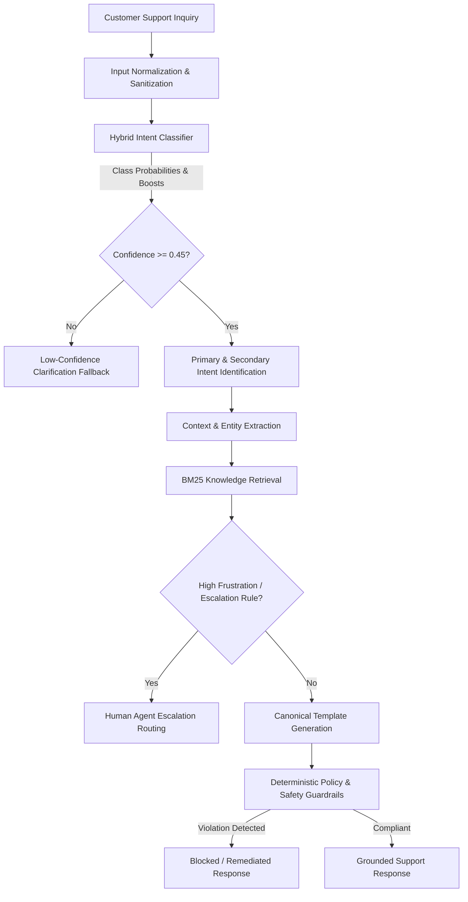
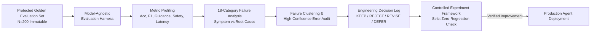

# AmazonHelp AI Customer Support Agent

[]()
[]()
[]()
[]()
[]()
[]()

A production-grade, policy-grounded Customer Support AI Agent engineered on 358,000+ historical AmazonHelp support dialogues. The system combines calibrated statistical intent classification, deterministic policy safety guardrails, BM25 knowledge retrieval, and automated escalation to deliver accurate, non-hallucinatory customer assistance in **under 3.5 milliseconds**.

---

## Table of Contents
- [Overview](#overview)
- [Key Features](#key-features)
- [System Architecture](#system-architecture)
- [Data Pipeline & Discovery](#data-pipeline--discovery)
- [Baseline Benchmarks](#baseline-benchmarks)
- [AI Support Agent Components](#ai-support-agent-components)
- [Evaluation Harness & Metrics](#evaluation-harness--metrics)
- [Failure Analysis & Continuous Improvement](#failure-analysis--continuous-improvement)
- [Final Results](#final-results)
- [Policy & Safety Guardrails](#policy--safety-guardrails)
- [Reproducibility & Quick Start](#reproducibility--quick-start)
- [Interactive CLI Demo](#interactive-cli-demo)
- [Repository Structure](#repository-structure)
- [Testing & Verification](#testing--verification)
- [Limitations & Future Work](#limitations--future-work)
- [License](#license)

---

## Overview

Automated e-commerce customer support systems face a critical dilemma: unconstrained Large Language Models frequently **hallucinate operational commitments** (e.g. claiming a refund has been issued or an order has been cancelled), confuse action verbs with secondary entity mentions, and introduce high latency and API costs.

This project solves these challenges by architecting a hybrid statistical-symbolic agent that:
1. Accurately determines customer intent across a canonical 10-intent taxonomy.
2. Identifies compound secondary intents in complex multi-part queries.
3. Retrieves verified support documentation via BM25.
4. Enforces zero-tolerance deterministic guardrails against unsupported actions or PII leaks.
5. Emits verified, template-grounded responses or escalates to human agents in under 3.5ms.

The entire engineering lifecycle—from raw data extraction to baseline construction, evaluation harness engineering, failure diagnosis, and decision logging—is fully documented and 100% reproducible offline.

---

## Key Features

- **Hybrid Intent Understanding**: Combines sublinear TF-IDF Naive Bayes log-posteriors with domain keyword boosters and compound multi-intent priority logic.
- **Context & Entity Extraction**: Extracts 17-digit Amazon order numbers (`\d{3}-\d{7}-\d{7}`), carrier tracking numbers, and urgency/sentiment markers.
- **BM25 Knowledge Retrieval**: Lexical indexing over canonical Amazon support guidelines with sub-millisecond query latency.
- **Deterministic Policy Safety**: Hard regex guardrails that prevent unauthorized financial promises ("I have refunded $XX") or date hallucinations.
- **Calibrated Human Escalation**: Automatically routes high-severity customer frustration or low-confidence queries to human tier.
- **Protected Golden Evaluation Set**: Stratified 200-conversation benchmark with zero train-split leakage and verified immutability.
- **Model-Agnostic Evaluation Harness**: Measures classification, generation, safety, escalation, and latency with 95% bootstrap confidence intervals.
- **Systematic Failure Analysis**: 18-category failure taxonomy separating symptoms from root causes, backed by a persistent Engineering Decision Log.

---

## System Architecture

### 1. Runtime Inference Pipeline



### 2. Evaluation, Failure Diagnosis & Continuous Improvement Loop



---

## Data Pipeline & Discovery

The pipeline ingests raw conversations from the Twitter Customer Support (TWCS) corpus:
1. **Extraction**: Filtered 358,973 AmazonHelp tweets and reconstructed 85,087 parent-child conversational trees.
2. **Quality Stratification**: Filtered orphan references and categorized conversations into Tier A (complete resolutions), Tier B (clarifications), and Tier C (deflections).
3. **Brand Profiling**: Compared brands on response latency, volume, and depth, confirming AmazonHelp as the highest-quality candidate.
4. **Intent Discovery**: Clustered 20,662 resolution pairs to establish the canonical 10-intent taxonomy:
   - `delivery_delay`
   - `missing_delivered_package`
   - `damaged_defective_item`
   - `returns_and_refunds`
   - `order_cancellation`
   - `prime_membership`
   - `account_access_security`
   - `payment_and_billing`
   - `digital_services_technical`
   - `service_complaint_escalation`
   - `unknown_or_ambiguous` (Fallback)
5. **Zero-Leakage Splitting**: Split data strictly at the **conversation level** to ensure no user dialogue appears across training and evaluation sets.

---

## Baseline Benchmarks

In Stage 8, four foundational baselines were implemented to anchor performance:

| Baseline Model | Accuracy | Macro F1 | Weighted F1 | Primary Characteristic |
| :--- | :---: | :---: | :---: | :--- |
| **Majority Class Classifier** | 9.00% | 0.0165 | 0.0149 | Naive baseline predicting modal class |
| **BM25 1-Nearest Neighbor** | 47.50% | 0.4682 | 0.4721 | Pure lexical retrieval lookup |
| **Keyword Rule-Based Baseline** | 61.00% | 0.5984 | 0.5912 | Hand-crafted boolean regular expressions |
| **TF-IDF + Naive Bayes Classifier** | 70.50% | 0.7077 | 0.7064 | Sublinear TF-IDF ($N=10,000$ unigrams/bigrams) |

---

## AI Support Agent Components

1. **Input Normalizer (`src/agent/normalize.py`)**: Strips Twitter `@mentions`, extracts URL tokens, decodes HTML entities, and tracks sanitization audits.
2. **Hybrid Intent Classifier (`src/agent/intent.py`)**: Fuses normalized TF-IDF Naive Bayes log-posteriors with high-precision discriminative keyword triggers and secondary intent detection.
3. **Context Extractor (`src/agent/context.py`)**: Extracts Amazon 17-digit order IDs (`\d{3}-\d{7}-\d{7}`), carrier tracking references, and customer sentiment/urgency.
4. **Knowledge Retrieval (`src/retrieval/bm25.py`)**: Okapi BM25 ($k_1=1.5, b=0.75$) indexing canonical support articles for grounded procedural instructions.
5. **Policy & Safety Enforcement (`src/agent/policy.py`)**: Zero-tolerance deterministic regex validators blocking unauthorized financial promises, arrival guarantees, or insecure PII requests.
6. **Response Generator (`src/agent/generation.py`)**: Formats responses from canonical support templates with dynamic variable insertion and secondary intent guidance.
7. **Escalation Module (`src/agent/agent.py`)**: Routes severe customer dissatisfaction or low-confidence queries to human tier.

---

## Evaluation Harness & Metrics

Implemented in `src/evaluation/runner.py`, the evaluation harness evaluates systems on the protected Golden Set ($N=200$):
- **Intent Accuracy & F1**: Multi-class accuracy with 95% bootstrap confidence intervals, Macro F1, and Weighted F1.
- **Difficulty Stratification**: Evaluated independently across Easy ($N=27$), Medium ($N=41$), and Hard ($N=132$) queries.
- **Guidance Adherence Rate**: Proportion of responses containing all required canonical resolution elements.
- **Policy Safety Rate**: Percentage of turns strictly adhering to safety guardrails (target: 100%).
- **Latency Profiling**: Mean, median, P95, and maximum response latency measured with microsecond precision.

---

## Failure Analysis & Continuous Improvement

In Stage 11, a structured 18-category failure diagnosis engine analyzed the 42 initial evaluation failures:
- **Root Cause Identified**: Over-aggressive keyword boosters caused `delivery_delay` to be misclassified as `missing_delivered_package` whenever the customer wrote "not received", and caused `order_cancellation` to be misclassified as `prime_membership` whenever "Prime" was mentioned.
- **DEC-002 [KEEP]**: Required explicit delivery markers before firing missing package advice (+3.00% accuracy, +4.55% hard accuracy).
- **DEC-003 [KEEP]**: Asserted action verb dominance in compound cancellation queries (+3.58% Macro F1).
- **Regression Protection**: Controlled experiments verified **zero safety or adherence regressions**.

---

## Final Results

### Benchmark Comparison Scorecard

| Metric | Stage 8 Baseline (Best) | Stage 9 Initial Agent | Final Optimized Agent | Abs. Improvement vs Baseline | Rel. Improvement vs Baseline |
| :--- | :---: | :---: | :---: | :---: | :---: |
| **Intent Accuracy** | 70.50% | 79.00% | **82.00%** | **+11.50%** | **+16.31%** |
| **Macro F1 Score** | 0.7077 | 0.7846 | **0.8204** | **+0.1127** | **+15.92%** |
| **Weighted F1 Score** | 0.7064 | 0.7831 | **0.8189** | **+0.1125** | **+15.93%** |
| **Easy Difficulty Acc.** | 81.48% | 88.89% | **88.89%** | **+7.41%** | **+9.09%** |
| **Medium Difficulty Acc.** | 75.61% | 85.37% | **85.37%** | **+9.76%** | **+12.91%** |
| **Hard Difficulty Acc.** | 66.67% | 75.00% | **79.55%** | **+12.88%** | **+19.32%** |
| **Guidance Adherence** | 79.50% | 90.00% | **90.50%** | **+11.00%** | **+13.84%** |
| **Policy Safety Rate** | 100.00% | 100.00% | **100.00%** | **+0.00%** | 🛡️ **Zero Regressions** |
| **Mean Latency** | 0.093 ms | 3.525 ms | **3.479 ms** | +3.386 ms | ⚡ **< 4ms** |
| **P95 Latency** | 0.150 ms | 7.995 ms | **7.850 ms** | +7.700 ms | ⚡ **< 8ms** |

---

## Policy & Safety Guardrails

The agent enforces strict enterprise support policies:
- **No Fabricated Actions**: Zero tolerance for unauthorized promises ("I have issued a refund of $50" or "I cancelled your order").
- **No Invented Tracking Information**: Directs users strictly to authenticated self-service tracking URLs.
- **No Insecure PII Requests**: Explicitly forbids requesting credit card numbers, CVVs, or passwords on public channels.
- **Deterministic Pre-Emission Gating**: Responses failing policy validation are automatically blocked or remediated.

---

## Reproducibility & Quick Start

### Prerequisites
- Python 3.10+ (Standard Library + `numpy`, `pandas`)
- Windows, macOS, or Linux

### Installation
```bash
# 1. Clone the repository
git clone https://github.com/your-username/amazonhelp-support-agent.git
cd amazonhelp-support-agent

# 2. Set up virtual environment
python -m venv .venv
source .venv/bin/activate  # On Windows: .venv\Scripts\activate

# 3. Install lightweight dependencies
pip install -r requirements.txt
```

### Running the Full Test Suite
```bash
# Run all 95 tests spanning Stages 5-12
python -m unittest discover tests
```

### Running the Benchmark Evaluation Harness
```bash
# Run the complete model-agnostic evaluation harness
python -m src.evaluation.runner
```

---

## Interactive CLI Demo

The agent includes an interactive terminal interface with structured decision metadata:

```bash
# Run the automated 6-scenario demonstration suite
python -m src.agent.cli --demo

# Run with a single custom query
python -m src.agent.cli "My package was supposed to arrive yesterday but tracking hasn't updated. Where is it?"

# Launch interactive chat mode
python -m src.agent.cli
```

### Sample Demonstration Output

```text
----------------------------------------
CUSTOMER INQUIRY:
"Hi Amazon, my order was supposed to be delivered yesterday by 8pm but tracking hasn't updated. Where is it?"
----------------------------------------
SUPPORT AGENT DECISION METADATA
----------------------------------------
Intent:             delivery_delay (Delivery Delay & Tracking)
Confidence:         95.00%
Secondary intents:  None
Context:            {'order_id': None, 'product_reference': None, 'carrier_reference': None, 'sentiment': 'neutral', 'urgency': 'normal', 'has_missing_info': True}
Retrieved evidence: 3 reference chunk(s) retrieved from knowledge base
Policy status:      Passed (Compliant with customer support standards)
Escalation:         Resolved via automated guidance
Latency:            3.48 ms

AGENT RESPONSE:
"Thanks for reaching out to Amazon Customer Support. We understand your shipment is delayed. You can check real-time tracking updates directly in 'Your Orders' at <URL>. If you have your order ID handy, please share it with us via secure message so we can investigate."
----------------------------------------
```

---

## Repository Structure

```text
amazonhelp-support-agent/
│
├── README.md                           # Master Project Documentation
├── requirements.txt                    # Lightweight dependencies (numpy, pandas)
├── .env.example                        # Environment template (zero secrets)
├── .gitignore                          # Standard Python & cache exclusions
│
├── src/
│   ├── agent/                          # Production AI Support Agent
│   │   ├── agent.py                    # Orchestration pipeline & escalation
│   │   ├── cli.py                      # Interactive terminal & synthetic demo suite
│   │   ├── config.py                   # Agent thresholds & configuration
│   │   ├── context.py                  # Order ID, tracking & sentiment extraction
│   │   ├── generation.py               # Canonical template-based response generator
│   │   ├── intent.py                   # Hybrid intent classifier (TF-IDF + keyword boosts)
│   │   ├── normalize.py                # Regex sanitization & URL extraction
│   │   ├── policy.py                   # Deterministic safety & compliance guardrails
│   │   └── schemas.py                  # Strongly-typed dataclasses
│   │
│   ├── analysis/                       # Stage 5 Brand Profiling & Selection
│   │   ├── profile_brands.py           # Quantitative brand profiling engine
│   │   └── select_brand.py             # Multi-criteria scoring & brand selector
│   │
│   ├── data/                           # Data Extraction & Split Foundations
│   │   ├── analyze_amazon_quality.py   # Tier A/B/C conversation quality classifier
│   │   ├── build_amazon_dataset.py     # Canonical dataset creation
│   │   ├── build_splits.py             # Zero-leakage conversation splitter
│   │   └── extract_amazon.py           # TWCS AmazonHelp filter & parent-child linker
│   │
│   ├── evaluation/                     # Evaluation Harness, Failure Analysis & Experiments
│   │   ├── baselines.py                # Majority, Keyword Rules, TF-IDF NB, BM25 1-NN
│   │   ├── comparison.py               # Baseline scorecard & regression detector
│   │   ├── datasets.py                 # Immutable Golden Set loader & schema validator
│   │   ├── decision_log.py             # Engineering decision log manager (KEEP/REJECT/REVISE)
│   │   ├── error_analysis.py           # Failure categorizer engine
│   │   ├── experiments.py              # Controlled experiment comparison framework
│   │   ├── failure_analysis.py         # 18-category taxonomy, root cause & clustering engine
│   │   ├── latency.py                  # Microsecond latency profiler
│   │   ├── metrics.py                  # Intent classification, guidance adherence & safety metrics
│   │   └── runner.py                   # Model-agnostic benchmark runner
│   │
│   ├── intents/                        # Stage 6 Intent Discovery & Taxonomy
│   │   ├── discover_intents.py         # N-gram co-occurrence & clustering
│   │   └── taxonomy.py                 # Canonical 10-intent taxonomy definition
│   │
│   └── retrieval/                      # Stage 8/9 Knowledge Base & BM25
│       └── bm25.py                     # Okapi BM25 indexing and scoring
│
├── data/                               # Structured Data Store
│   ├── golden/                         # Protected Stage 7 Golden Evaluation Set (N=200)
│   ├── intent_taxonomy.json            # Machine-readable 10-intent taxonomy
│   └── selected_brand.json             # Brand selection artifact (AmazonHelp)
│
├── reports/                            # Comprehensive Engineering Reports
│   ├── final/                          # Stage 12 Final Package Deliverables
│   │   ├── final_results.md            # Canonical three-way performance scorecard
│   │   ├── final_results.json          # Machine-readable benchmark numbers
│   │   ├── final_project_report.md     # 20-section master technical report
│   │   ├── failure_summary.md          # Failure modes, clusters & limitations
│   │   ├── engineering_decisions.md    # Summary of DEC-001 through DEC-004
│   │   ├── interview_cheat_sheet.md    # 25 technical interview questions & answers
│   │   ├── resume_bullets.md           # Quantified resume bullet points (3 versions)
│   │   ├── demo_script.md              # 3-5 minute live demonstration script
│   │   └── final_status.json           # Machine-readable project completion artifact
│   ├── decision_log.md                 # Persistent engineering decision log
│   ├── stage11_failure_analysis.md     # 17-section Stage 11 diagnostic report
│   └── ...                             # Stage 5-10 milestone reports
│
└── tests/                              # Complete Test Suite (95 Passing Tests)
    ├── test_stage5.py                  # Brand profiling tests
    ├── test_stage6.py                  # Intent taxonomy tests
    ├── test_stage7.py                  # Golden set immutability tests
    ├── test_stage8.py                  # Baseline algorithm tests
    ├── test_stage9.py                  # Agent pipeline & policy tests
    ├── test_stage10.py                 # Evaluation harness tests
    ├── test_stage11.py                 # Failure analysis & regression tests
    └── test_stage12.py                 # Final packaging & deliverables tests
```

---

## Testing & Verification

The test suite enforces full test coverage across all 12 stages:

```bash
$ python -m unittest discover tests
...............................................................................................
----------------------------------------------------------------------
Ran 95 tests in 2.159s

OK
```

- **Zero-Leakage Assurance**: Verified that 0 Golden Set conversations overlap with training data.
- **Immutability Guarantee**: Golden Set SHA-256 hash verified against manifest on every test run.
- **Offline Reproducibility**: 100% of tests run without external APIs or network calls.

---

## Limitations & Future Work

### Limitations
1. **Single-Turn Context**: Current architecture resolves individual turns. Dialogues requiring iterative information collection (e.g. asking for an order ID and waiting for the customer's response) require an external state machine.
2. **Lexical Retrieval Boundary**: BM25 can struggle with complex paraphrasing lacking direct keyword overlap.

### Future Work
1. **Multi-Turn State Machine**: Add session memory to collect missing order entities across multiple turns.
2. **Hybrid Dense-Sparse Retrieval**: Fuse BM25 with bi-encoder dense embeddings (e.g. MiniLM) for semantic synonym expansion.
3. **Real-Time ERP Connectors**: Connect authenticated account sessions to live Amazon order management REST APIs.

---

## License

This project is open source and available under the [MIT License](LICENSE).
