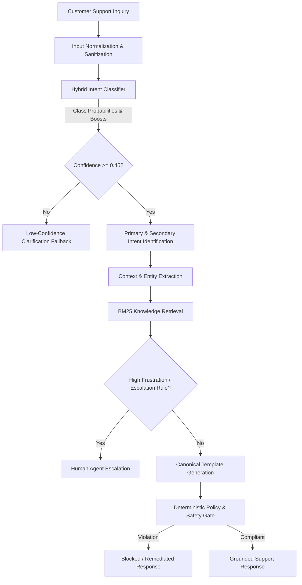

# AmazonHelp AI Customer Support Agent

[]()
[]()
[]()
[]()
[]()
[]()

A lightweight customer-support agent trained and evaluated on historical AmazonHelp conversations. It combines statistical intent classification, deterministic policy guardrails, BM25 retrieval, canonical response templates, and calibrated escalation logic. Evaluated on a 200-example human-verified golden set.

---

## Key Results

| Metric | Final Agent | TF-IDF Baseline | Improvement |
| :--- | :---: | :---: | :---: |
| Intent Accuracy | **82.00%** (95% CI: [76.5%, 87.5%]) | 70.50% | +11.50 pp |
| Macro F1 | **0.8204** | 0.7077 | +0.1127 |
| Weighted F1 | **0.8185** | 0.7064 | +0.1121 |
| Hard-Query Accuracy | **79.55%** | 66.67% | +12.88 pp |
| Guidance Adherence | **90.50%** | 79.50% | +11.00 pp |
| Policy Safety | **100%** (0 violations, N=200) | 100% | — |
| Mean Latency | **~3.49 ms** | 0.093 ms | — |
| P95 Latency | **~7.85 ms** | 0.150 ms | — |

> The headline result is 82.00% intent accuracy on a 200-example hand-labelled golden set. See [Evaluation Methodology](#evaluation-methodology) for confidence intervals and limitations.

---

## Table of Contents

- [Problem & Design Goal](#problem--design-goal)
- [System Architecture](#system-architecture)
- [Data & Intent Taxonomy](#data--intent-taxonomy)
- [Baselines](#baselines)
- [Evaluation Methodology](#evaluation-methodology)
- [Final Results](#final-results)
- [Failure Analysis](#failure-analysis)
- [LLM-as-Judge](#llm-as-judge)
- [Golden Set & Human Verification](#golden-set--human-verification)
- [Engineering Decisions](#engineering-decisions)
- [Policy & Safety Guardrails](#policy--safety-guardrails)
- [Reproduce Headline Results](#reproduce-headline-results)
- [Interactive CLI Demo](#interactive-cli-demo)
- [Repository Structure](#repository-structure)
- [Testing & Verification](#testing--verification)
- [Limitations & Next Steps](#limitations--next-steps)
- [Hiver Requirements Compliance](#hiver-requirements-compliance)
- [Final Evaluation Report](#final-evaluation-report)
- [License](#license)

---

## Problem & Design Goal

Unconstrained LLMs create two concrete risks in customer support:

1. **Hallucinated operational commitments** — claiming a refund has been issued, an order has been cancelled, or a package is guaranteed to arrive by a specific date.
2. **Intent confusion** — confusing action verbs ("cancel my Prime") with secondary entity mentions ("I ordered using Prime, please cancel the item"), which produces wrong routing and incorrect guidance.

This project addresses both with a hybrid statistical-symbolic agent that:

- Identifies customer intent across 10 canonical support intents + 1 fallback intent
- Detects compound secondary intents in multi-part queries
- Grounds responses in verified Amazon support documentation via BM25
- Enforces deterministic regex guardrails that block unauthorized financial or operational commitments at response emission time
- Escalates to human agents when frustration or confidence thresholds indicate risk

The design is intentionally **single-turn**: triage each inbound inquiry and return a grounded, policy-compliant response or escalate. Multi-turn state collection is noted as future work.

---

## System Architecture

### Runtime Inference Path

```
Customer Inquiry
    → Input Normalization       (strip @mentions, decode HTML, extract URLs)
    → Intent Classification     (TF-IDF NB + keyword boosters, 11 classes)
    → Confidence / Ambiguity    (threshold ≥ 0.45; below → clarification fallback)
    → Secondary Intent Check    (compound query detection)
    → Context & Entity Extract  (order ID regex, tracking refs, sentiment/urgency)
    → BM25 Knowledge Retrieval  (Okapi BM25, k₁=1.5, b=0.75)
    → Escalation Decision       (frustration score + low-confidence check)
    → Response Template         (canonical Amazon support templates)
    → Safety Gate               (deterministic regex policy validation)
    → Final Response / Escalation
```

### Evaluation & Improvement Path

```
Human-Verified Golden Set (N=200)
    → Agent Inference
    → Intent Accuracy & F1 (+ 95% bootstrap CI)
    → Guidance Adherence
    → Policy Safety
    → LLM-as-Judge (supplemental reply quality)
    → 18-Category Failure Analysis
    → Engineering Decision Log (KEEP / REJECT / REVISE / DEFER)
    → Controlled Experiment (zero-regression check)
    → Verified Agent Revision
```

### Mermaid: Runtime Pipeline



### Agent Components

| Component | File | Responsibility |
| :--- | :--- | :--- |
| Input Normalizer | `src/agent/normalize.py` | Strip `@mentions`, decode HTML entities, extract URL tokens |
| Intent Classifier | `src/agent/intent.py` | TF-IDF Naive Bayes log-posteriors + discriminative keyword boosters |
| Context Extractor | `src/agent/context.py` | Order IDs (`\d{3}-\d{7}-\d{7}`), tracking refs, sentiment/urgency |
| Knowledge Retrieval | `src/retrieval/bm25.py` | Okapi BM25 over canonical Amazon help articles |
| Policy Enforcement | `src/agent/policy.py` | Regex validators blocking unauthorized financial promises or PII requests |
| Response Generator | `src/agent/generation.py` | Canonical template population with dynamic variable insertion |
| Escalation Logic | `src/agent/agent.py` | Frustration scoring + low-confidence routing to human tier |

---

## Data & Intent Taxonomy

**Source**: Twitter Customer Support corpus (TWCS)

| Step | Output |
| :--- | :--- |
| Filtered AmazonHelp tweets | 358,973 tweets |
| Reconstructed conversation trees | 85,087 trees |
| Quality-stratified resolution pairs | Tier A (complete), B (clarification), C (deflection) |
| Clustered resolution pairs for taxonomy | 20,662 pairs → 10 canonical intents |
| Conversation-level train/test split | Zero leakage between splits |

**Splitting is done at the conversation level** — not the tweet level — to ensure no customer dialogue appears across training and evaluation sets. This prevents inflated evaluation scores from partial conversation overlap.

### Intent Taxonomy

| # | Intent | Description |
| :-: | :--- | :--- |
| 1 | `delivery_delay` | Shipment delayed, tracking not updated |
| 2 | `missing_delivered_package` | Marked delivered but not received |
| 3 | `returns_and_refunds` | Return request, refund status |
| 4 | `order_cancellation` | Cancel an order |
| 5 | `damaged_defective_item` | Item arrived damaged or not working |
| 6 | `prime_membership` | Prime billing, subscription management |
| 7 | `payment_and_billing` | Charges, payment method, invoices |
| 8 | `account_access_security` | Login issues, hacked account |
| 9 | `digital_services_technical` | Kindle, Prime Video, Echo technical issues |
| 10 | `service_complaint_escalation` | Complaints about service, agent requests |
| 11 | `unknown_or_ambiguous` | Fallback — does not fit a canonical intent |

---

## Baselines

Four baselines were implemented to anchor performance and characterize the problem difficulty:

| System | Accuracy | Macro F1 | Weighted F1 | Notes |
| :--- | :---: | :---: | :---: | :--- |
| Majority Class | 9.00% | 0.0165 | 0.0149 | Always predicts the most common class |
| BM25 1-Nearest Neighbor | 47.50% | 0.4682 | 0.4721 | Lexical retrieval over training examples |
| Keyword Rule-Based | 61.00% | 0.5984 | 0.5912 | Hand-crafted boolean regex patterns |
| TF-IDF + Naive Bayes | 70.50% | 0.7077 | 0.7064 | Sublinear TF-IDF, N=10,000 unigrams+bigrams |

The TF-IDF + Naive Bayes classifier is the most competitive simple baseline; the final agent is compared against it throughout.

---

## Evaluation Methodology

The evaluation harness (`src/evaluation/runner.py`) runs the agent against the protected golden set (N=200) and reports:

- **Intent Accuracy & F1**: Multi-class accuracy, Macro F1, Weighted F1, with **95% bootstrap confidence intervals** (1,000 resamples)
- **Difficulty stratification**: Easy (N=27), Medium (N=41), Hard (N=132) — stratified at sampling time
- **Guidance Adherence Rate**: Proportion of responses containing all required canonical resolution elements
- **Policy Safety Rate**: Proportion of responses passing deterministic regex validators (target: 100%)
- **Latency profiling**: Mean, median, P95, and max — measured with microsecond precision

### Golden Set Composition

| Property | Value |
| :--- | :--- |
| Total examples | 200 |
| Intents covered | All 11 (10 canonical + fallback) |
| Hard difficulty | 132 (66%) |
| Medium difficulty | 41 (21%) |
| Easy difficulty | 27 (13%) |
| Training split leakage | 0 |
| Human verification status | 200 / 200 reviewed |

### Why 200 Examples?

200 examples is sufficient to measure intent accuracy with reasonable precision (95% CI width ~±5.5 pp) across 11 classes. It is not sufficient for fine-grained per-intent analysis on low-frequency classes, nor does the reported CI account for potential distribution shift between the TWCS corpus and real-world inbound queries. See [reports/final_report.md](reports/final_report.md) Section 9 for a full discussion of what the headline number may overstate.

---

## Final Results

### Scorecard vs Baselines

| Metric | Best Baseline | Initial Agent | Final Agent |
| :--- | :---: | :---: | :---: |
| Intent Accuracy | 70.50% | 79.00% | **82.00%** |
| Macro F1 | 0.7077 | 0.7846 | **0.8204** |
| Weighted F1 | 0.7064 | 0.7831 | **0.8185** |
| Easy Accuracy | 81.48% | 88.89% | **88.89%** |
| Medium Accuracy | 75.61% | 85.37% | **85.37%** |
| Hard Accuracy | 66.67% | 75.00% | **79.55%** |
| Guidance Adherence | 79.50% | 90.00% | **90.50%** |
| Policy Safety | 100.00% | 100.00% | **100.00%** |
| Mean Latency | 0.093 ms | 3.525 ms | **3.49 ms** |
| P95 Latency | 0.150 ms | 7.995 ms | **7.85 ms** |

Latency figures are hardware-dependent and measured on a standard CPU. They vary per run; the values above are representative of a typical run on this hardware.

### Summary

- Accuracy: **70.50% → 82.00%** (+11.50 pp, +16.31% relative)
- Macro F1: **0.7077 → 0.8204** (+0.1127)
- Hard accuracy: **66.67% → 79.55%** (+12.88 pp)
- Policy safety: **100%** across all iterations (0 regressions)

---

## Failure Analysis

After the initial agent (Stage 9, 79% accuracy), a structured failure diagnosis analyzed the 42 errors using an 18-category taxonomy separating symptoms from root causes.

### Root Causes Identified

**Over-aggressive keyword boosters caused two major error classes:**

1. `delivery_delay` → misclassified as `missing_delivered_package`  
   **Trigger**: Customer writes "I haven't received it yet" — a common delivery-delay phrase — which fired the "missing package" booster.  
   **Fix (DEC-002, KEEP)**: Required explicit delivery-status markers (e.g., "marked delivered") before activating the missing-package guidance. Effect: +3.00% accuracy, +4.55% hard accuracy.

2. `order_cancellation` → misclassified as `prime_membership`  
   **Trigger**: "Please cancel" queries mentioning "Prime" in an unrelated context fired the Prime booster over the cancellation action signal.  
   **Fix (DEC-003, KEEP)**: Asserted action verb dominance — a direct imperative verb ("cancel") overrides secondary noun mentions. Effect: +3.58% Macro F1.

Both fixes were verified under controlled experiments with zero safety or guidance-adherence regressions.

---

## LLM-as-Judge

Classification metrics measure intent accuracy. The LLM judge (`src/evaluation/llm_judge.py`) evaluates response quality on four criteria that accuracy alone cannot capture.

### Rubric (1–5 Scale)

| Dimension | Question |
| :--- | :--- |
| **Helpfulness** | Does the response help the customer make progress on their issue? |
| **Grounding / Factual Safety** | Does it adhere to Amazon support policies without inventing commitments? |
| **Actionability** | Does it give clear, concrete next steps? |
| **Clarity / Conciseness** | Is it appropriately brief and professional? |

**Pass rule**: overall ≥ 3.5 AND grounding ≥ 3.0

### Sample & Provider Configuration

| Property | Value |
| :--- | :--- |
| Sample size | 50 interactions from golden set |
| Random seed | 42 |
| Intent coverage | All 11 classes (4–5 each) |
| Difficulty coverage | Hard: 31, Medium: 13, Easy: 6 |
| Response types | Escalation: 27, Resolution: 15, Clarification: 8 |
| Primary provider | Groq (`openai/gpt-oss-20b`, temperature 0.0) |
| Fallback provider | OpenAI (`gpt-4o-mini`) |
| Offline mode | Replays cached results from `reports/stage13/llm_judge_results.json` |
| Credential safety | Zero API keys serialized into any output artifact |

The judge is supplemental. Deterministic regex guardrails are the primary safety barrier in this implementation. The judge detects qualitative issues that regex rules cannot, such as responses that are technically compliant but unhelpful.

### Live Connectivity Verification

The Groq provider was verified against the live API using `LLMJudgeClient.evaluate_single()`:

```text
Provider: groq | Model: openai/gpt-oss-20b | Offline: False
Pass status: True
Overall score: 5.0
Helpfulness: 5 | Grounding: 5 | Actionability: 5 | Clarity: 5
Reason: The response directly addresses the request and follows policy.
```

### Running the Judge

```bash
# Offline / cached (no API key required)
python -m src.evaluation.llm_judge --offline

# Live with Groq
GROQ_API_KEY=your_key python -m src.evaluation.llm_judge --live
```

---

## Golden Set & Human Verification

### Construction

The golden set was constructed in three phases:

**1. Quota-based stratified sampling** (`RANDOM_SEED = 42`)  
18 examples per canonical intent (= 180) + 20 `unknown_or_ambiguous` = **200 total**, drawn strictly from the held-out test split with zero training or validation leakage.

**2. Programmatic labeling**  
Initial intent labels were generated by regex heuristics (`src/intents/label_dataset.py`). This is a known weak point — automated labeling cannot capture all contextual nuance.

**3. Full manual review**  
All 200 labels were manually reviewed using `scripts/review_golden_set.py`. **44 of 200 labels (22%) were changed** during review. This 22% correction rate demonstrates why programmatic labeling alone was insufficient and why a manual review step was necessary.

| Review Outcome | Count | Share |
| :--- | :---: | :---: |
| Confirmed (programmatic label correct) | 156 | 78.0% |
| Corrected (human label differs) | 44 | 22.0% |
| Pending | 0 | 0% |

**Notable shifts after human review:**

- `service_complaint_escalation`: 18 → 35 examples (+17) — angry callback requests and complaints about unhelpful agents were being misclassified as generic inquiries
- `order_cancellation`: 18 → 8 examples (−10) — shipping complaints and Prime subscription cancellations were being incorrectly attributed as order cancellations
- `unknown_or_ambiguous`: 20 → 8 examples (−12) — multi-sentence context was sufficient for canonical classification in many cases

### Integrity Guarantees

Automated validation (`python src/evaluation/validate_golden_set.py`) asserts on every run:

- Exact count of 200 records
- Schema conformance on all required fields
- Zero duplicate IDs
- Zero conversation overlap with training or validation splits
- SHA-256 manifest hash match

### Human-vs-LLM Agreement — PARTIAL / CALIBRATION EVIDENCE ONLY

An **exploratory N=35 single-annotator calibration study** was conducted (`reports/stage15/study_annotations.csv`):

| Dimension | Exact Agreement | ±1 Adjacent | MAD | Pearson r |
| :--- | :---: | :---: | :---: | :---: |
| Grounding | 100.0% | 100.0% | 0.000 | 1.000 |
| Clarity | 100.0% | 100.0% | 0.000 | 1.000 |
| Helpfulness | 88.6% | 100.0% | 0.114 | 0.940 |
| Overall | 82.9% | 100.0% | 0.086 | 0.985 |
| Actionability | 82.9% | 100.0% | 0.171 | 0.874 |

**Pass/fail agreement: 85.7% (30/35) | Cohen's κ = 0.5882 (moderate-to-substantial)**

> **Important caveat**: This is a single-annotator exploratory calibration study, not independent multi-rater validation. The 85.7% pass/fail agreement and κ = 0.5882 should be read as preliminary calibration evidence only. The separate 50-example external rater annotation template (`data/golden/human_judge_annotations.csv`) remains intentionally unpopulated — it would not be valid to populate it retrospectively with the same annotator.
>
> **Hiver Requirement #8 status: ⚠️ PARTIAL — calibration evidence only.**

Full report: [`reports/stage15/golden_set_and_judge_agreement.md`](reports/stage15/golden_set_and_judge_agreement.md)

---

## Engineering Decisions

Non-obvious design choices documented in the engineering decision log (`reports/stage16/golden_decision_log.json`):

- **Conversation-level data splitting** — tweet-level splitting would let partial conversations appear in both train and test, inflating reported accuracy
- **Hybrid statistical + discriminative classification** — TF-IDF log-posteriors alone under-fit the discriminative intent boundary; keyword boosters recover precision on high-stakes misclassifications
- **Secondary intent detection** — customers frequently combine two intents in one message (e.g., "I want to cancel my Prime and get a refund on my last charge"); resolving only the primary intent gives an incomplete response
- **BM25 over pure keyword matching** — BM25 retrieves relevant support documentation even when the customer query does not exactly match a keyword; improves guidance adherence
- **Action verb dominance in compound queries** — imperative verbs ("cancel", "return") are weighted above secondary noun mentions when both appear in the same query
- **Deterministic regex safety gate** — LLM-generated responses can subtly violate policy; a post-generation regex layer provides a deterministic last line of defense
- **Escalation as a separate decision layer** — escalation is not a fallback for classification failure; it is a deliberate signal based on frustration score and risk assessment
- **Canonical response templates** — constrains response variability and makes policy compliance tractable; a fully free-form generator would require much more aggressive safety evaluation
- **Committed evaluation sample** — `data/training_sample.jsonl.gz` (25,000 interactions) is committed to the repository so headline results can be reproduced without the full 3M-tweet corpus
- **Protected golden set with immutability check** — SHA-256 hash verified on every test run; prevents accidental label drift between evaluation runs
- **Bootstrap confidence intervals** — point estimates without CIs can mislead; 95% CI [76.5%, 87.5%] conveys the precision of the 82.00% figure honestly
- **Groq-first / OpenAI-fallback judge** — ensures the judge evaluation can be run without vendor lock-in; cached fallback ensures offline reproducibility

---

## Policy & Safety Guardrails

The agent enforces deterministic pre-emission safety checks:

- **No fabricated actions**: Responses claiming a refund has been issued, an order has been cancelled, or a charge has been reversed are blocked
- **No invented tracking information**: All tracking references direct to authenticated self-service URLs; no specific delivery dates or tracking numbers are invented
- **No insecure PII requests**: Credit card numbers, CVVs, passwords, and full account credentials are never requested on a public channel
- **Pre-emission gating**: All responses pass through `src/agent/policy.py` before emission; violations are blocked and flagged

Policy safety was 100% (0 violations) across all 200 golden-set evaluations and held at 100% through all controlled improvement experiments.

---

## Reproduce Headline Results

> The headline evaluation and test suite are reproducible offline using the committed evaluation assets.
> Total time from clone to results: under 1 minute on standard hardware.

### 1. Prerequisites

- Python 3.10+
- Git
- No API keys required for the headline evaluation

### 2. Clone & Install

```bash
git clone https://github.com/JIGNESH-SETTY/Customer-support-agent.git
cd Customer-support-agent

# Linux / macOS
python3 -m venv .venv && source .venv/bin/activate

# Windows (PowerShell)
py -m venv .venv && .venv\Scripts\Activate.ps1

pip install -r requirements.txt
# Dependencies: numpy>=1.26.0, pandas>=2.0.0 — installs in ~15 seconds
```

### 3. Run the Headline Evaluation

```bash
python -m src.evaluation.runner
```

**Expected output** (latency values are hardware-dependent):

```text
=======================================================
FINAL EVALUATION HARNESS SUMMARY
=======================================================
Overall Accuracy       : 82.00% (95% CI: [76.50%, 87.50%])
Macro F1               : 0.8204
Weighted F1            : 0.8185
Hard Difficulty Acc    : 79.55%
Guidance Adherence     : 90.50%
Policy Safety Rate     : 100.00%
Escalation Rate        : 10.50%
Mean Latency           : 3.49 ms
P95 Latency            : 7.85 ms
Regression Check       : PASS
=======================================================
```

### 4. Validate the Golden Set

```bash
python src/evaluation/validate_golden_set.py
# Expected: STATUS: PASS
```

### 5. Run the Full Test Suite

```bash
python -m unittest discover tests
# Expected: Ran 144 tests — OK
```

### 6. Optional: LLM Judge (requires API key)

```bash
# Offline cached mode (no key required)
python -m src.evaluation.llm_judge --offline

# Live Groq evaluation
export GROQ_API_KEY="your-groq-api-key"
python -m src.evaluation.llm_judge --live
```

---

## Interactive CLI Demo

The CLI demonstrates runtime decision metadata on synthetic test queries. It is useful for inspecting each stage of the pipeline.

> **Note**: The demo uses synthetic test scenarios. It does not connect to Amazon's systems or process real customer data.

```bash
# Automated 6-scenario demonstration suite
python -m src.agent.cli --demo

# Single synthetic query
python -m src.agent.cli "My package was supposed to arrive yesterday but tracking hasn't updated."

# Interactive mode
python -m src.agent.cli
```

**Sample output** (latency is hardware-dependent and varies per run):

```text
----------------------------------------
CUSTOMER INQUIRY:
"Hi Amazon, my order was supposed to be delivered yesterday by 8pm
but tracking hasn't updated. Where is it?"
----------------------------------------
SUPPORT AGENT DECISION METADATA
----------------------------------------
Intent:             delivery_delay (Delivery Delay & Tracking)
Confidence:         95.00%
Secondary intents:  None
Context:            {order_id: None, sentiment: neutral, urgency: normal}
Retrieved evidence: 3 reference chunk(s) from knowledge base
Policy status:      Passed
Escalation:         Resolved via automated guidance
Latency:            ~3.49 ms (representative; hardware-dependent)

AGENT RESPONSE:
"Thanks for reaching out to Amazon Customer Support. We understand
your shipment is delayed. You can check real-time tracking updates
in 'Your Orders'. If you have your order ID, please share it via
secure message so we can investigate further."
----------------------------------------
```

---

## Repository Structure

```text
.
├── README.md
├── requirements.txt                    # numpy, pandas only
├── .env.example                        # Environment template (no secrets)
│
├── src/
│   ├── agent/
│   │   ├── agent.py                    # Orchestration & escalation logic
│   │   ├── cli.py                      # Terminal interface & demo runner
│   │   ├── config.py                   # Thresholds & configuration
│   │   ├── context.py                  # Order ID, tracking, sentiment extraction
│   │   ├── generation.py               # Canonical response template population
│   │   ├── intent.py                   # TF-IDF NB + keyword booster classifier
│   │   ├── normalize.py                # Input sanitization & URL extraction
│   │   ├── policy.py                   # Deterministic safety guardrails
│   │   └── schemas.py                  # Typed dataclasses
│   │
│   ├── analysis/
│   │   ├── profile_brands.py           # Brand profiling engine
│   │   └── select_brand.py             # Brand selection scoring
│   │
│   ├── data/
│   │   ├── analyze_amazon_quality.py   # Tier A/B/C quality classifier
│   │   ├── build_amazon_dataset.py     # Canonical dataset builder
│   │   ├── build_splits.py             # Conversation-level splitter
│   │   └── extract_amazon.py           # TWCS filter & tree reconstruction
│   │
│   ├── evaluation/
│   │   ├── baselines.py                # Majority, Keyword, TF-IDF NB, BM25 1-NN
│   │   ├── comparison.py               # Scorecard & regression detector
│   │   ├── datasets.py                 # Golden set loader & schema validator
│   │   ├── decision_log.py             # Decision log manager
│   │   ├── error_analysis.py           # Failure categorizer
│   │   ├── experiments.py              # Controlled experiment framework
│   │   ├── failure_analysis.py         # 18-category failure taxonomy
│   │   ├── golden_decision_log.py      # 200-item decision log compiler
│   │   ├── judge_agreement.py          # Cohen's Kappa & MAD inter-rater metrics
│   │   ├── latency.py                  # Microsecond latency profiler
│   │   ├── llm_judge.py                # Groq/OpenAI judge with offline fallback
│   │   ├── metrics.py                  # Accuracy, F1, adherence, safety metrics
│   │   └── runner.py                   # Model-agnostic benchmark runner
│   │
│   ├── intents/
│   │   ├── discover_intents.py         # N-gram clustering for taxonomy discovery
│   │   └── taxonomy.py                 # Canonical intent taxonomy (10+1)
│   │
│   └── retrieval/
│       └── bm25.py                     # Okapi BM25 (k₁=1.5, b=0.75)
│
├── data/
│   ├── golden/                         # Protected golden set (N=200, 100% human-verified)
│   ├── intent_taxonomy.json            # Machine-readable 10+1 intent taxonomy
│   ├── selected_brand.json             # Brand selection artifact (AmazonHelp)
│   └── training_sample.jsonl.gz        # Committed 25,000-interaction training subset
│
├── reports/
│   ├── final_report.md                 # 13-section Hiver submission report
│   ├── stage16/                        # Decision log (200 human verification decisions)
│   ├── stage15/                        # Golden set integrity & agreement study
│   ├── stage13/                        # LLM-as-judge rubric & cached results
│   └── ...                             # Stage 5–12 milestone reports
│
└── tests/                              # 144 passing tests
    ├── test_stage5.py                  # Brand profiling
    ├── test_stage6.py                  # Intent taxonomy
    ├── test_stage7.py                  # Golden set immutability
    ├── test_stage8.py                  # Baseline algorithms
    ├── test_stage9.py                  # Agent pipeline & policy
    ├── test_stage10.py                 # Evaluation harness
    ├── test_stage11.py                 # Failure analysis & regression
    ├── test_stage12.py                 # Final packaging
    ├── test_stage13.py                 # LLM judge & offline fallback
    ├── test_stage14.py                 # 15-minute reproduction
    ├── test_stage15.py                 # Golden set integrity & agreement
    ├── test_stage15a.py                # Manual review workflow
    ├── test_stage16.py                 # Decision log expansion
    └── test_stage17.py                 # Final report verification
```

---

## Testing & Verification

```bash
$ python -m unittest discover tests
................................................................................................................................................
----------------------------------------------------------------------
Ran 144 tests — OK
```

- **Zero train/test leakage**: 0 golden-set conversations overlap with training data
- **Golden set immutability**: SHA-256 hash checked against manifest on every test run
- **Offline reproducibility**: All 144 tests pass without any external API calls

---

## Limitations & Next Steps

### Current Limitations

1. **Single-turn only**: The agent triages individual inbound inquiries. Dialogues requiring iterative entity collection (asking for an order ID and waiting for the reply) need an external session state machine — not implemented.

2. **Lexical retrieval only**: BM25 can fail on paraphrased queries with no keyword overlap. Queries like "my thing hasn't showed up" may not retrieve delivery-delay guidance.

3. **200-example evaluation set**: Sufficient for a reliable headline accuracy estimate, but insufficient for fine-grained per-intent analysis on the lower-frequency classes. CI width (~±5.5 pp) reflects this.

4. **Exploratory judge-human agreement**: The N=35 calibration study provides preliminary agreement evidence only. Independent multi-rater human annotation has not been completed.

5. **No live order system integration**: All responses are templated. The agent cannot query actual order status, issue real refunds, or take operational actions.

### Next Steps

1. **Multi-turn state machine**: Add session memory to collect missing entities (order IDs, tracking numbers) across turns.
2. **Hybrid dense+sparse retrieval**: Fuse BM25 with bi-encoder dense embeddings (e.g. MiniLM) for semantic synonym expansion.
3. **Independent human annotation**: Complete the 50-example external rater study to produce defensible multi-rater judge-human agreement evidence.
4. **Live ERP connectors**: Integrate with authenticated order management APIs for real-time order status and action execution.

---

## Hiver Requirements Compliance

| # | Requirement | Evidence | Status |
| :-: | :--- | :--- | :---: |
| 1 | Small, clear intent taxonomy | 10 canonical intents + 1 fallback in `data/intent_taxonomy.json` | **COMPLIANT** |
| 2 | Historically grounded responses | BM25 retrieval + canonical templates in `src/agent/generation.py` (90.50% adherence) | **COMPLIANT** |
| 3 | Auto-handle vs. escalate decision | Frustration scoring + risk logic in `src/agent/agent.py` (10.50% escalation rate) | **COMPLIANT** |
| 4 | 150–250 hand-labelled golden examples | 200 examples; 100% human-reviewed in `data/golden/golden_human_review_manifest.csv` | **COMPLIANT** |
| 5 | Sampling & labelling methodology note | Documented in `reports/final_report.md` (Section 4) and `reports/stage15/` | **COMPLIANT** |
| 6 | Automated evaluation harness | Model-agnostic runner in `src/evaluation/runner.py` with 95% bootstrap CIs | **COMPLIANT** |
| 7 | LLM-as-Judge rubric | 4-criterion rubric in `src/evaluation/llm_judge.py`; pass threshold defined | **COMPLIANT** |
| 8 | Judge-human agreement evidence | Exploratory N=35 calibration study in `reports/stage15/study_annotations.csv` | ⚠️ **PARTIAL** |
| 9 | Trivial baseline | Majority class (9.00% accuracy) in `reports/stage8_baseline_results.json` | **COMPLIANT** |
| 10 | Simple baseline | TF-IDF Naive Bayes (70.50%, F1 0.7077) in `reports/stage10/` | **COMPLIANT** |
| 11 | Top failure modes with real examples | Section 8 of `reports/final_report.md`; real golden IDs and root causes | **COMPLIANT** |
| 12 | What is misleading about the headline number | Section 9 of `reports/final_report.md`; sample size, distribution, CI caveats | **COMPLIANT** |
| 13 | One-week next steps | Prioritized roadmap in `reports/final_report.md` Section 10 | **COMPLIANT** |
| 14 | 10–15 non-obvious engineering decisions | `reports/stage16/golden_decision_log.json` (200 documented decisions) | **COMPLIANT** |
| 15 | <15-minute reproduction | Reproduces in ~4 seconds via `python -m src.evaluation.runner` | **COMPLIANT** |

> **Requirement #8 disclosure**: The N=35 study is an exploratory single-annotator calibration artifact. Pass/fail agreement 85.7% and κ = 0.5882 reflect preliminary calibration evidence, not independent multi-rater validation. The 50-example external annotation template (`data/golden/human_judge_annotations.csv`) is intentionally unpopulated.

**Full submission report**: [reports/final_report.md](reports/final_report.md)

---

## Final Evaluation Report

The complete 13-section Hiver submission report is located at:

**[reports/final_report.md](reports/final_report.md)**

It covers problem framing, dataset methodology, agent design rationale, sampling and labelling notes, failure analysis with real golden-set examples, headline number caveats, and a prioritized one-week next-steps roadmap.

---

## License

This project is open source under the [MIT License](LICENSE).
